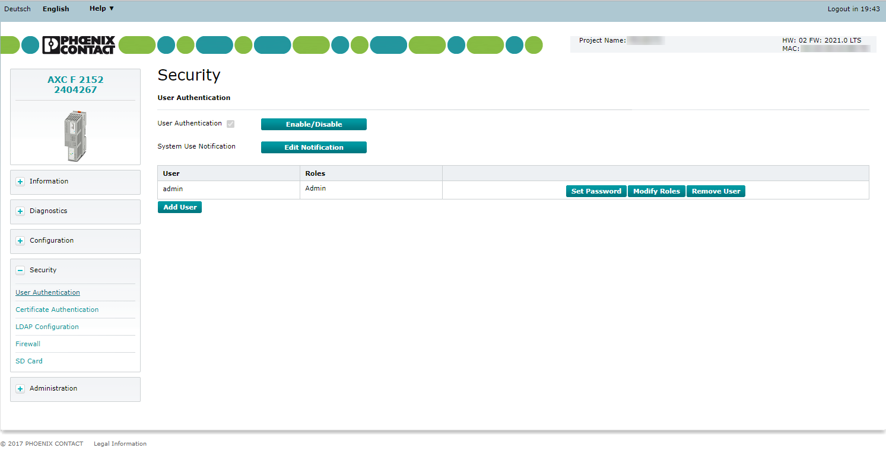

# WEB capabilities of the PLCnext platform
##  Web-based Management 

### WBM access and first steps:
Each PLCnext Technology controller features a web-based management (WBM). In the WBM, you can access static and dynamic controller information and modify certain controller settings. You can call WBM via every Ethernet interface of the controller.

####  Establishing a connection to WBM 
To establish a connection to WBM, proceed as follows:
- Open the web browser on your PC.
- In the address field, enter the URL https://IP.address.of.controller (example: https://192.168.1.10).
 
#####  Note: 
WBM can only be called if the controller has a valid IP address. Upon delivery, the controller has IP address 192.168.1.10 (Ethernet interface LAN1 in case of several Ethernet interfaces).

#####  Note: 
If there is a PLCnext Engineer  HMI application on the controller, entering URL https://IP address of the controller calls the PLCnext Engineer application.
To call WBM in this case, enter the URL https://IP.address.of.controller/wbm.

##### Initial access: Welcome page
The controller welcome page is shown when the controller web server is accessed for the first time.

    

The welcome page contains links to the following web content:
- WBM of the controller
- PLCnext Community 

####  Login to Web-based Management 
The WBM login page is displayed when:
- You access WBM for the first time.
- You have enabled the WBM user authentication function, see User Authentication page.
If you disable user authentication, login is not necessary to access WBM. In this case, the WBM start page is displayed when WBM is accessed.

    

##### Initial access as an administrator
When you access WBM for the first time, log in as the administrator.

- Enter the user name admin in the Username input field.
- Enter the administrator password in the Password input field.
The administrator password is printed on the controller. For more detailed information, refer to the user manual for your controller.
- To open WBM, click on the Login button.

=> The WBM start page opens.

##### Logging in as a user
If WBM user authentication is enabled, log in using your user details.

- Enter your user name in the Username input field.
- Enter your password in the Password input field.
- To open WBM, click on the Login button.

=> The WBM start page opens.

### Information - General Data:
####  General Data page 
On the General Data page, you will find general details about the device, e.g., hardware and firmware versions, the order number, as well as manufacturer details.

    

### Information - Network configuration:
####  Network Configuration page 
The Network configuration page provides status information on all Ethernet interfaces on a controller. 

 Note:  In this page, the current configuration is displayed only. It's not an interface to change the settings in any way.

    

### Security - User Authentication:
####  User Authentication page 
The security-related settings for the controller are configured in the  Security  area of the Web-based Management (WBM).

Enable or disable user authentication on the  User Authentication  page. When user authentication is enabled, authentication with a user name and password is required for access to certain components of the controller and certain functions in PLCnext Engineer.

    

When  User Authentication  is disabled, authentication is not necessary to access the WBM, the OPC UA server of the controller, or to access the controller using PLCnext Engineer. Access to the file system via SFTP and access to the shell via SSH requires authentication (with administrator rights) even if user authentication is disabled.

User authentication is enabled by default. In the delivery state, the  admin  user is already created with administrator rights.

### Firewall configuration:
####  Concept 
PLCnext Technology  relies on the proven and commonly used Linux® firewall nftables. On the PLCnext Control, you don't need to configure the firewall rules via cryptic Linux shell commands: Just log on to the Web-based Management and choose from the predefined basic rules, or add your own rules to the set.

####  How to work with the WBM user interface 

The controller firewall is configured via the Web-based Management. Log in to the WBM as Admin, unfold the  Security  area and click on Firewall to see the configuration page (PLCnext Control AXC F 2152 as an example):

    

##  PLCnext Engineer 
### PLCnext Engineer user interface:

    

1. Menu bar
2. Tool bar
3. PLANT area
4. Editors area
5. COMPONENTS area
6. Cross-functional area
7. Status bar

### Transferring a project to the controller
To transfer the project to the controller, proceed as follows:
- Double-click the controller node in the PLANT area.

The controller editor group opens.
- Select the Cockpit editor.
- Write project to controller and start execution. (F5).

 Please note: 

When user authentication is enabled, authentication with a user name and password is required in order to execute this function.
User authentication is enabled by default. You can disable user authentication via the User Manager.

If user authentication is enabled, the function can only be executed by users whose user roles have the necessary authorization.

- Enter your user name and password in the dialog that opens.
If you do not have the necessary authorization to execute the function, PLCnext Engineer informs you of this in a message.

The project is compiled, transferred to the controller, and executed.

### Creating a PLCNEXT TECHNOLOGY HMI application
####  General information 

In PLCNEXT TECHNOLOGY, you can create an HMI application with which you can visualize, monitor and control your application on your controller.

A PLCNEXT TECHNOLOGY HMI application contains one or more HMI pages with standard HMI objects or predefined HMI symbols that are assigned to HMI tags. The HMI tags are used to exchange data between the PLCNEXT TECHNOLOGY HMI application and the controller.

An HMI tag is comparable to an HMI-internal variable. Each HMI tag needs to be assigned to a global variable created in the project. This assignment enables the PLCNEXT TECHNOLOGY HMI application to access the global variables.

The data of the HMI application are automatically saved as project data. The HMI application is part of the project. If a project is transferred to the controller, the HMI application is transferred simultaneously (see Transferring a project to the controller). In addition to the application logic and configuration and parameterization data, the project includes all relevant HMI data. When using the web server of your controller, the HMI application can be executed via a standard browser, enabling processes running on the controller to be monitored and controlled.

Requirement for a PLCNEXT TECHNOLOGY HMI application:

You need a finished project for a PLCNEXT TECHNOLOGY HMI application.

####  Executing the PLCNEXT TECHNOLOGY HMI application 

To execute the PLCNEXT TECHNOLOGY HMI application, proceed as follows:

- Click on the controller node in the PLANT area.

=> The editor group of the controller opens.

- Select the Cockpit editor.
- Click on the Execute HMI application button (launches default browser to display your HMI pages).

=> The start page of the PLCNEXT TECHNOLOGY HMI application opens in your default browser.